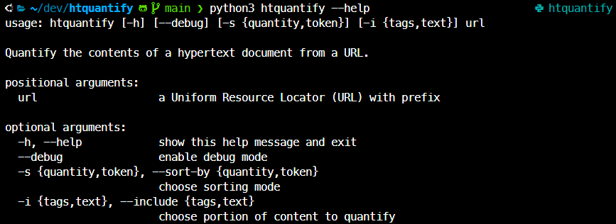
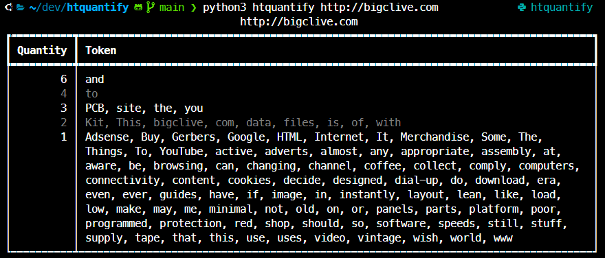

# CEPR 740 Final Project: "htquantify"
Code Louisville @ BU: Python

htquantify is a CLI program that takes a URL, navigates to a site, scrapes and tokenizes its content, counts the tokens, and produces a tabular display of the results. Users may choose to display data about text nodes or HTML elements, and sort results numerically by quantity or alphabetically by token. Requires a connection to the Internet to be used.

## Examples

## Dependencies
Name | Type | Reason | Note
---- | ---- | ------ | ----
git | Source Control | Needed to acquire project files. |
python3 | Interpreter | Needed to execute '.py' files. | Developed for version 3.8 and up.
bs4 | PyPI Module | Needed to parse HTML files. |
rich | PyPI Module | Needed to assemble tabular output. |

## Installation
1. [Install Python version 3.8 or higher](https://www.python.org/downloads/)
2. Open your terminal or command line and navigate to a folder suitable for storing the project
3. Clone this repository:   `git clone https://github.com/aallehoff/htquantify.git`
4. Change directory into repo folder:  `cd htquantify`
5. (_optional_) Create and initialize virtual environment:  `python3 -m venv venv/htquantify` and `source venv/htquantify/bin/`
6. Install PyPI module dependencies:  `pip install -r requirements.txt`
7. Run project:  `python htquantify --help`

## Project Features
Requirements (3 or more) | Compliance (8)
--------------------- | ----------
Create a class, then create at least one object of that class and populate it with data | Three (3) classes, at least one instance each
Create a dictionary or list, populate it with several values, retrieve at least one value, and use it in your program | One (1) dictionary, populated with variable amount of data depending on URL given at run time, manipulated in several ways to display results
Create and call at least 3 functions, at least one of which must return a value that is used | Sixteen (16) functions as class methods, at least one returning a value that is then consumed elsewhere
Implement a regular expression (regex) to ensure a field either a phone number or an email address is always stored and displayed in the same format | One (1) regular expression is compiled and used to tokenize text nodes
Calculate and display data based on an external factor (ex: get the current date, and display how many days remaining until some event) | Results of quantification are derived from content hosted on the Internet and vary depending on URL provided by user at runtime
Analyze text and display information about it (ex: how many words in a paragraph) | Elements and text nodes of HTML documents are analyzed for quantity and displayed in a table
Visualize data in a graph, chart, or other visual representation of data | Results of quantification are displayed in a table printed to STDOUT
Implement a “scraper” that can be fed a type of file or URL and pull information off of it. For example, a web scraper that lets you provide any website URL and it will find certain keywords on the page | Scrapes content on the Internet from a given URL

## Future Work
* Add logging and unittest functionality
* Add quantification of `<style>` and `<script>` element content (CSS & JS)
* Replace `html.parser` with a more accurate parser (e.g. html5lib)
* Replace naive text node tokenizer logic with something more advanced (e.g. Treebank)
* Add option to output HTML report
* Add data visualization